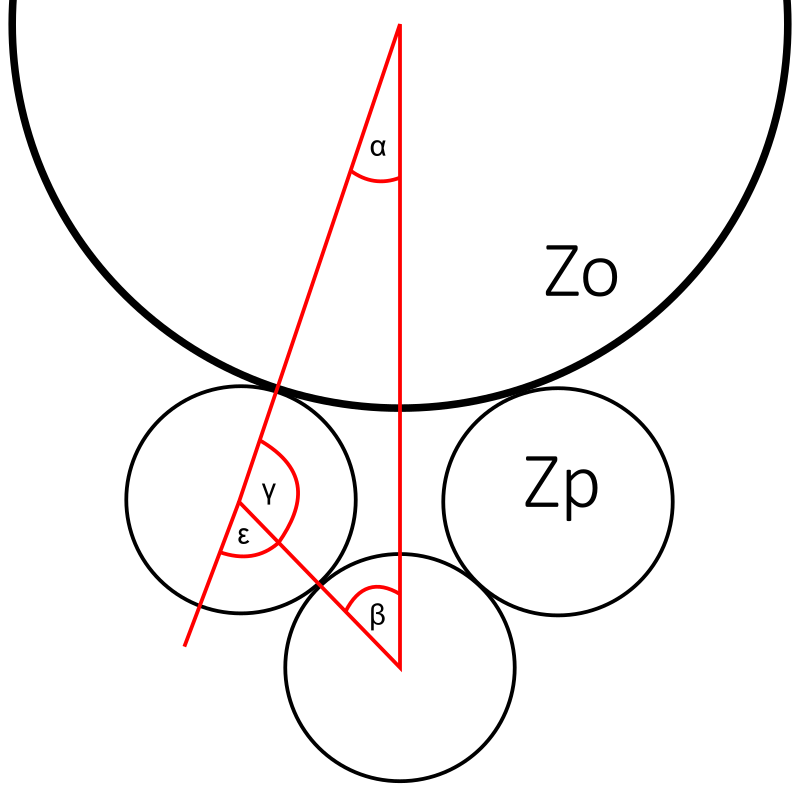

# 4-Spur-Gear Calculator

A desktop GUI application for interpolation calculations on a system of four meshing spur gears. The tool finds all angular positions (α) where the final rotation of the pinion aligns exactly with a whole number or half tooth pitch — valid positions for gear engagement.



---

## The Problem

When assembling four spur gears in a spatial arrangement, finding a valid meshing position is non-trivial. Simply relying on pitch circles is not sufficient — the gears must be positioned so that the tooth gaps on mating gears are precisely aligned.

**Goal:** Given the tooth counts (Z₁, Z₂) and module (m), find all angles α that define a valid meshing configuration.

---

## How It Works

### Coordinate system and angle α

The calculation begins from the assumption that at α = 0° the gears overlap perfectly (tooth gaps facing each other). From this starting point, gear 1 is rolled to the left along its pitch diameter. This rolling causes gear 2 to rotate. Because only one side of the system is solved (the other is symmetric), a single sweep of α is sufficient.

### Rolling and rotation

After rotating gear 1 by angle α, gear 2 is displaced from the central axis. It must then be rotated back by angle ε to realign — which in turn causes further rotation of gear 2.

After computing all angles (α, β, γ, ε), the rolled arc lengths O₁ and O₂ are calculated, giving the final rotation φ of the output gear:

$$\varphi_c = \varphi - \alpha + \varepsilon$$

### Solution condition

The final rotation φ must be divisible by the tooth angular pitch (360° / Zₚ). The result of that division must be a **whole number** or a **half number** (e.g. 12 or 12.5) — otherwise the teeth do not align.

### Numerical interpolation

No closed-form analytical solution exists for this system. The application therefore sweeps α from α_min to α_max in fine steps, evaluating the condition at every step. All configurations satisfying the condition are reported as solutions.

| Symbol | Description |
|--------|-------------|
| **α** | Primary angle swept during interpolation |
| **β** | Derived angle (law of sines) |
| **γ** | Supplementary angle: `180° − β − α` |
| **ε** | Realignment angle: `180° − γ` |
| **O₁, O₂** | Arc lengths rolled along gear 1 and gear 2 |
| **φ** | Final rotation angle of the output gear |

---

## Features

- Automatically computes the valid angular range [α_min, α_max] from gear parameters
- Sweeps through the interval with a user-defined interpolation step
- Classifies solutions as **whole number** or **half** tooth pitch alignments
- Displays the geometry diagram directly in the results panel (requires Pillow)
- Runs calculations in a background thread — UI stays responsive during long sweeps
- Builds to a standalone Windows `.exe` via PyInstaller

---

## Input Parameters

| Parameter | Description | Default |
|-----------|-------------|---------|
| **Zo** | Number of teeth on the large gear | 80 |
| **Zp** | Number of teeth on the pinion | 30 |
| **m** | Gear module (mm) — defines tooth size | 2.0 |
| **Tolerance** | Acceptable deviation for solution detection | 0.000003 |
| **Step (°)** | Angular interpolation step size | 0.00001 |

---

## Solution Types

| Type | Condition |
|------|-----------|
| **Whole number** | `φ / tooth_pitch` is within tolerance of an integer |
| **Half** | `φ / tooth_pitch` is within tolerance of N + 0.5 |

---

## Installation & Usage

**Requirements:** Python 3.8+

```bash
# Install optional dependency for diagram display
pip install pillow

# Run the application
python ozubena_kola_gui.py
```

No other dependencies are required — `tkinter` is included with Python.

---

## Build Standalone Executable

```bash
pip install pyinstaller pillow
pyinstaller ozubena_kola_gui.spec
```

The compiled `.exe` will be placed in the `dist/` folder.

> Pre-built Windows executables are available on the [Releases](../../releases) page.

---

## Authors

Developed by **Malý Vratislav** & **Karel Vondráček**

---

## License

This project is open source. Feel free to use, modify, and share it.
